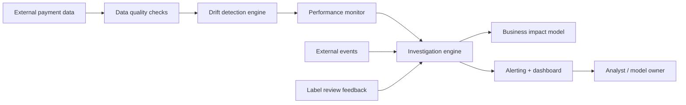

# Architecture diagram

```mermaid
flowchart LR
    A[External payment data] --> B[Data quality checks]
    B --> C[Drift detection engine]
    C --> D[Performance monitor]
    D --> E[Investigation engine]
    E --> F[Business impact model]
    E --> G[Alerting + dashboard]
    G --> H[Analyst / model owner]
    I[External events] --> E
    J[Label review feedback] --> E
```
